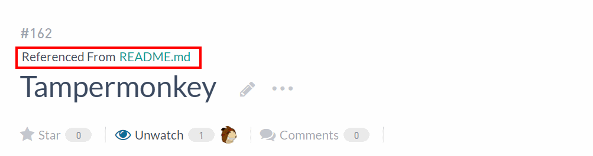

# 概要

esa.io の Referenced From をページのヘッダー部分に表示する

- 行間を狭く
- ファイル名、フォルダ名をボタンクリックでコピー

# 動作確認環境

- google chrome
- windows 10
- Tampermonkey

# 使い方

- ビルドをして out/script.user.js を作成
- ファイルを Tampermonkey にコピペ

# ビルド方法

- `npm ci`
- `npm run build`

# Licence

MIT License
